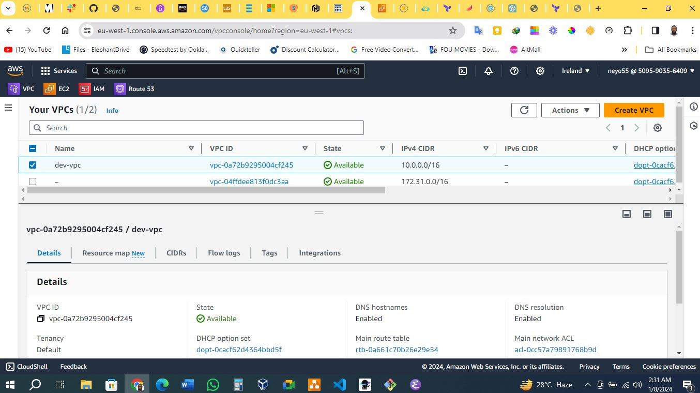
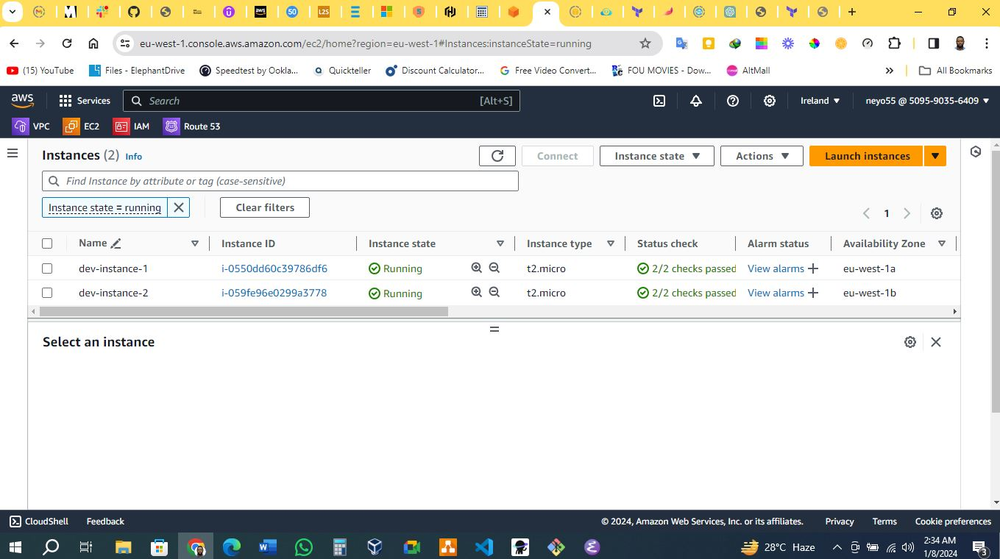
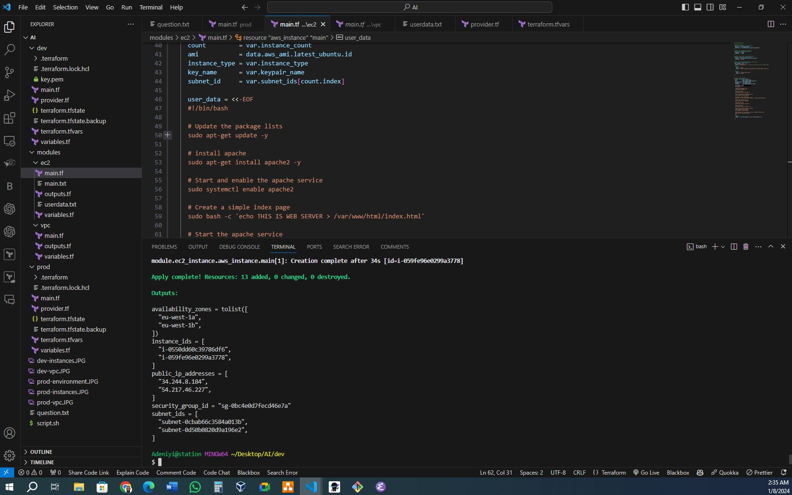
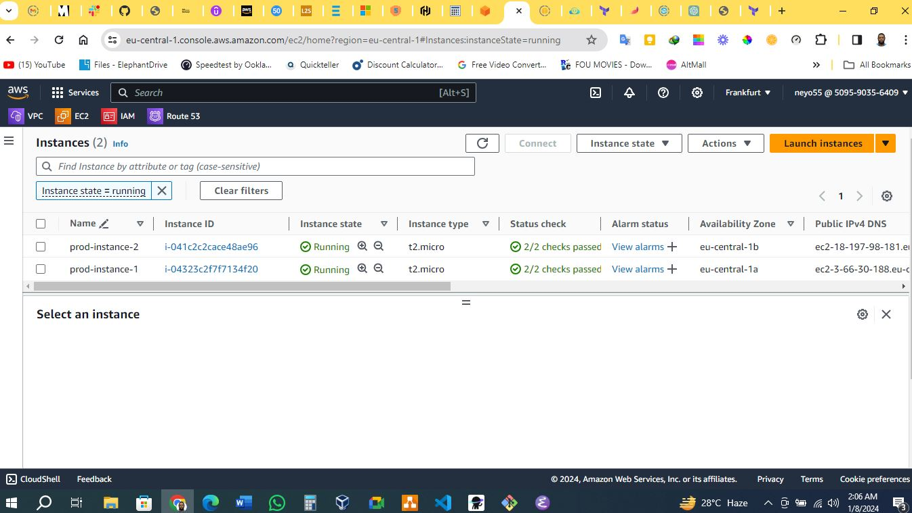
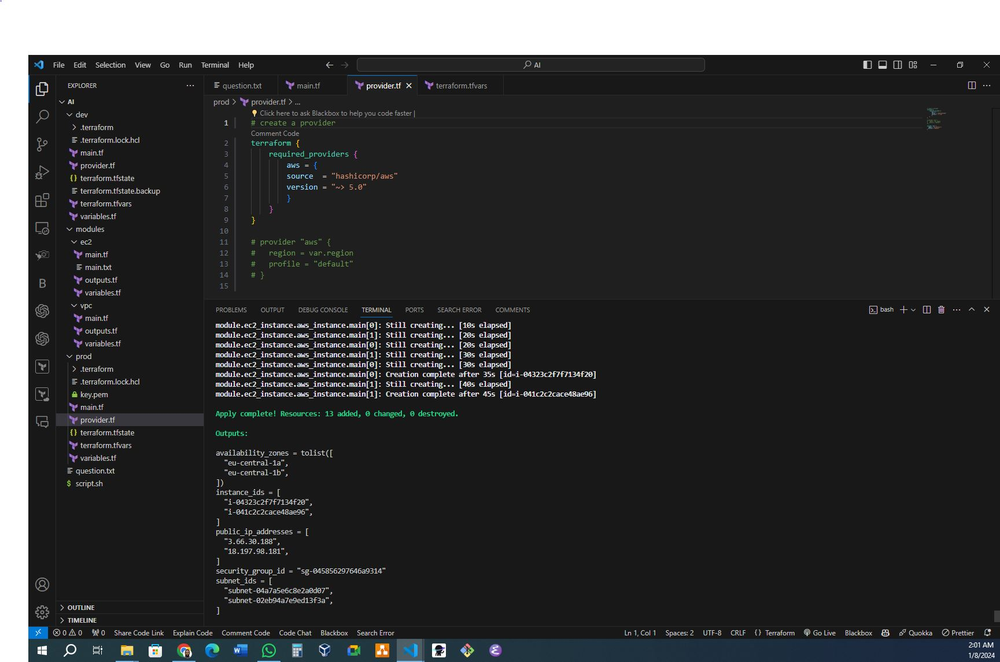

# Terraform Project Documentation

## Table of Contents
- [Terraform Project Documentation](#terraform-project-documentation)
  - [Table of Contents](#table-of-contents)
  - [1. Introduction](#1-introduction)
  - [2. Prerequisites](#2-prerequisites)
  - [3. Directory Structure](#3-directory-structure)
  - [4. VPC Module](#4-vpc-module)
    - [Vpc modules configuration](#vpc-modules-configuration)
    - [vpc modules outputs](#vpc-modules-outputs)
    - [5. Instance Module](#5-instance-module)
    - [ec2 module configuration](#ec2-module-configuration)
    - [ec2 module outputs](#ec2-module-outputs)
  - [6. Environments](#6-environments)
    - [Dev Environment](#dev-environment)
    - [Prod Environment](#prod-environment)
  - [7. Best Practices](#7-best-practices)
  - [8. Testing](#8-testing)
    - [This is the VPC created in eu-west-1](#this-is-the-vpc-created-in-eu-west-1)
    - [These are the instances created in eu-west-1](#these-are-the-instances-created-in-eu-west-1)
      - [The instances are both public in each availability zone (eu-west-1a and eu-west-1b)](#the-instances-are-both-public-in-each-availability-zone-eu-west-1a-and-eu-west-1b)
    - [This is the output information generated in eu-west-1](#this-is-the-output-information-generated-in-eu-west-1)
      - [The availability zones, instance ids, public ip addresses, security group id and subnet ids](#the-availability-zones-instance-ids-public-ip-addresses-security-group-id-and-subnet-ids)
    - [This is the VPC created in eu-central-1](#this-is-the-vpc-created-in-eu-central-1)
    - [These are the instances created in eu-central-1](#these-are-the-instances-created-in-eu-central-1)
      - [The instances are both public in each availability zone (eu-central-1a and eu-central-1b)](#the-instances-are-both-public-in-each-availability-zone-eu-central-1a-and-eu-central-1b)
    - [This is the output information generated in eu-central-1](#this-is-the-output-information-generated-in-eu-central-1)
      - [The availability zones, instance ids, public ip addresses, security group id and subnet ids](#the-availability-zones-instance-ids-public-ip-addresses-security-group-id-and-subnet-ids-1)
  - [9. Usage](#9-usage)
  - [12. Contributing](#12-contributing)
  - [10. References](#10-references)
  - [11. Conclusion](#11-conclusion)

## 1. Introduction

This documentation provides an overview and detailed information about the Terraform project designed to deploy and manage infrastructure on AWS. The project is organized into modules for VPC creation, security groups configuration, and EC2 instances provisioning, it is also built across multiple environments "dev and prod" each on a different region (eu-west-1 and eu-central-1) specifically, with a minimum of at least 2 availability zone in each region, there is also a bash script to install ansible and docker on the EC2 instances. 
## 2. Prerequisites

Ensure the following prerequisites are met before using this Terraform project:

- AWS account with appropriate credentials.
- AWS CLI installed and configured.
- Terraform installed on the local machine.

## 3. Directory Structure

```plaintext
--dev
    --provider.tf
    --main.tf
    --variables.tf
    --terraform.tfvars
--prod
    --provider.tf
    --main.tf
    --variables.tf
    --terraform.tfvars
--modules
  --vpc
    --main.tf
    --variables.tf
    --outputs.tf
  --ec2
    --main.tf
    --variables.tf
    --outputs.tf       
```
- **`modules`**: Contains individual modules for VPC (Network) and ec2 (instance).
- **`environments`**: Includes environment-specific configurations for the dev and prod environments.
- **`terraform.tfvars`**: Terraform variable files for defining environment-specific variables.

## 4. VPC Module

### Vpc modules configuration

The VPC module (`modules/vpc`) is responsible for creating a Virtual Private Cloud on AWS. It includes the following key components:

- VPC
- Subnet
- Security Group
- Internet Gateway
- Route Table
- Route Table Association

[View VPC Module Configuration](/modules/vpc/main.tf)

### vpc modules outputs

- `subnet_id`: ID of the subnet.
- `security_group_id`: ID of the security group.
- `availability_zones`: Availability zone of the Region.

[View VPC Module Outputs](/modules/vpc/outputs.tf)

### 5. Instance Module

### ec2 module configuration

The Instance module (`modules/ec2`) provisions EC2 instance in the subnets. It includes:

- Ubuntu-focal-20.04 LTS AMI
- Key Pair Generation

[View Instances Module Configuration](/modules/ec2/main.tf)

### ec2 module outputs

- `instance_ids`: ID of the instances.
- `public_ip_addresses`: Public IP address of the instance.

[View EC2 Module Outputs](/modules/ec2/outputs.tf)

## 6. Environments

### Dev Environment

- Configuration for the development environment (`dev`).

### Prod Environment

- Configuration for the production environment (`prod`).

## 7. Best Practices

- Used consistent naming conventions for resources.
- Added comments to explain resource purposes and configurations.
- Tested configurations in a non-production environment before applying to production.
- Used Terraform modules to organize and reuse configurations.
- Used folders to organize Terraform environments.
- Used variables to define environment-specific configurations.
- Used outputs to reference resource attributes.
- Used a backend to store Terraform state files.

## 8. Testing

Testing was conducted in both the dev and prod environments. The following tests were performed:

- **VPC**: Created a VPC with 1 subnet in each availability zone.

### This is the VPC created in eu-west-1



### These are the instances created in eu-west-1
#### The instances are both public in each availability zone (eu-west-1a and eu-west-1b)



### This is the output information generated in eu-west-1
#### The availability zones, instance ids, public ip addresses, security group id and subnet ids




### This is the VPC created in eu-central-1


### These are the instances created in eu-central-1
#### The instances are both public in each availability zone (eu-central-1a and eu-central-1b)



### This is the output information generated in eu-central-1
#### The availability zones, instance ids, public ip addresses, security group id and subnet ids




## 9. Usage

To use this project:

1. Clone the project's GitHub repository: [GitHub Repository Link](https://github.com/neyo55/3rd-semester-assignment-1).

2. Ensure you have terraform installed on your local machine. to install terraform follow the instructions on this link: [Terraform Installation](https://learn.hashicorp.com/tutorials/terraform/install-cli).

3. Ensure you have AWS CLI installed and configured on your local machine. to install AWS CLI follow the instructions on this link: [AWS CLI Installation](https://docs.aws.amazon.com/cli/latest/userguide/cli-chap-install.html).

4. Ensure you have an AWS account with appropriate credentials.

5. Navigate to the project directory.

6. change the values of the variables in the `terraform.tfvars` file to match your environment.

7. change the values of the variables in the `dev/terraform.tfvars` file to match your environment.

8. change the values of the variables in the `prod/terraform.tfvars` file to match your environment.

9. change the values of the provider configuration in the `dev/provider.tf` file to match your environment.

10. change the values of the provider configuration in the `prod/provider.tf` file to match your environment.

11. To run this code navigate to the environment directory and type `terraform init`.
 
12. The next is to run `terraform plan` to plan your code and to know what is going to be deployed.

13. If everything looks good then proceed to deploy by typing `terraform apply` after successful deployment the output details is shown.

14. Run `terraform destroy --auto-approve` to destroy the Terraform configurations that was previously applied.

## 12. Contributing

Contributions to this project are highly welcomed. If you would like to contribute, follow these steps:

1. Fork the project's GitHub repository.

2. Create a new branch for your bug fix.

3. Make your changes and commit them to your branch.

4. Submit a pull request to the main repository for review and integration.

## 10. References

- [Terraform Documentation](https://www.terraform.io/docs/index.html)
- [Terraform AWS Provider Documentation](https://registry.terraform.io/providers/hashicorp/aws/latest/docs)
- [Terraform AWS Modules](https://registry.terraform.io/modules/terraform-aws-modules)
- [Terraform Best Practices](https://www.terraform-best-practices.com/)
- [AWS CLI Documentation](https://docs.aws.amazon.com/cli/index.html)
- [AWS CLI Configuration](https://docs.aws.amazon.com/cli/latest/userguide/cli-configure-quickstart.html)
- [AWS CLI Credentials](https://docs.aws.amazon.com/cli/latest/userguide/cli-configure-files.html)

## 11. Conclusion

This documentation provides a comprehensive guide to the Terraform project structure, configurations, and best practices.

Thank you for using this project and good luck!

